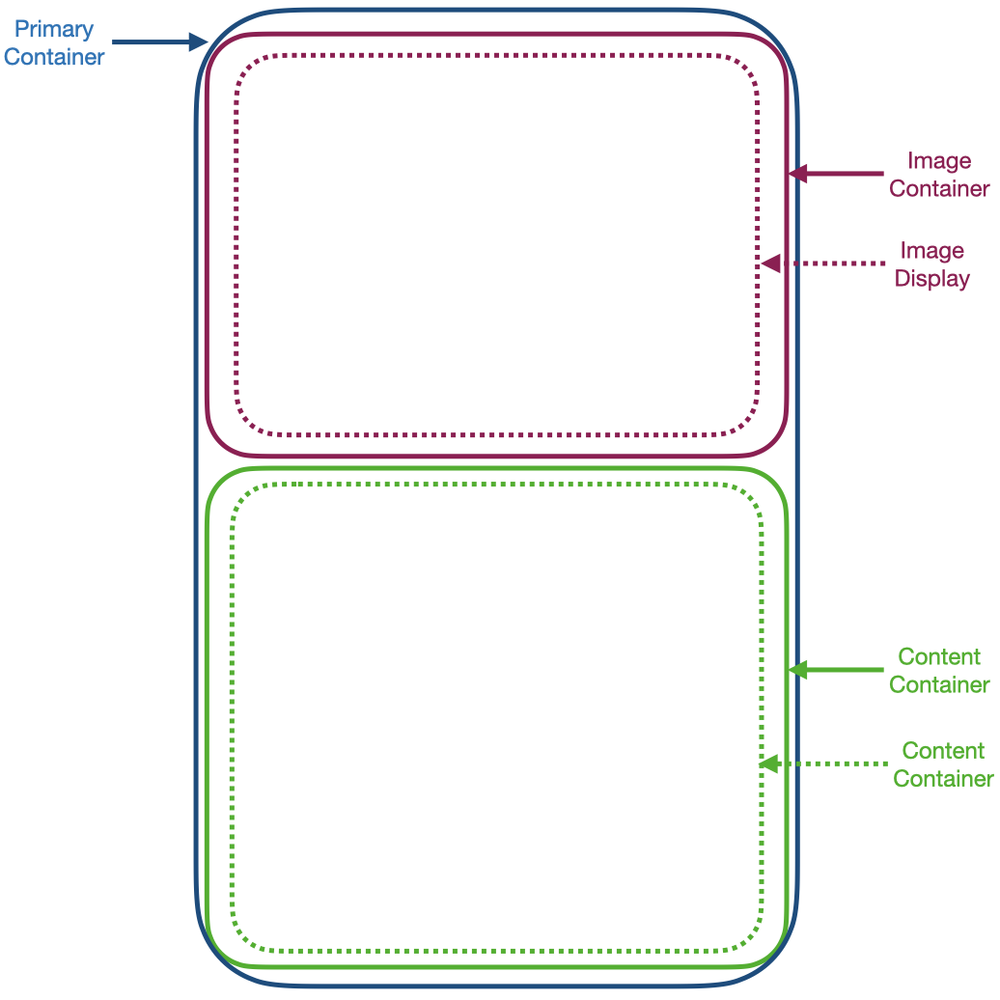
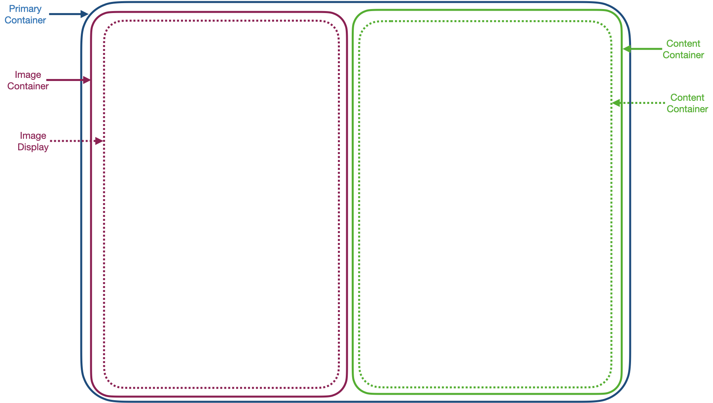

# Getting Started with Create React App

This project was bootstrapped with [Create React App](https://github.com/facebook/create-react-app).

Specifically:

```
> npm create-react-app product-review --template typescript
```

## Additional NPM installs:

This project requires the following two installs:

```
> npm install sass
> npm install react-icons
```

## General Architectural layout:

### Mobile Component layout


### Desktop Component layout


From the project directory, to open the project in a local browser you can run:

```
> npm start
```

## Structural layout and logig:

	- src
		index.tsx //The primary react-app standard starting code
		App.tsx //Sets up the initial page and creates a flex-box to center the main UI

		- Components
			- PrimaryContainer
				ContainerContent.tsx // The grid cell which will hold the content display component 
				ContainerImage.tsx // The grid cell which will hold the image display component
				PrimaryContainer.tsx //Sets up the 2-row (mobile) / 2-column (desktop) grid

			- DisplayElements
				ContentDisply.tsx //The component which lays out the textual information 
				ImageDisplay.tsx  //The component which lays out the image 

### Logic of the architecture

	Have the components which need to be worked through to iron out the layout isolated from the content.

	Then, have the components which display data isolated from issues with the overall layout of the primary page.


### `npm test`

Launches the test runner in the interactive watch mode.\
See the section about [running tests](https://facebook.github.io/create-react-app/docs/running-tests) for more information.

### `npm run build`

Builds the app for production to the `build` folder.\
It correctly bundles React in production mode and optimizes the build for the best performance.

The build is minified and the filenames include the hashes.\
Your app is ready to be deployed!

See the section about [deployment](https://facebook.github.io/create-react-app/docs/deployment) for more information.

### `npm run eject`

**Note: this is a one-way operation. Once you `eject`, you can’t go back!**

If you aren’t satisfied with the build tool and configuration choices, you can `eject` at any time. This command will remove the single build dependency from your project.

Instead, it will copy all the configuration files and the transitive dependencies (webpack, Babel, ESLint, etc) right into your project so you have full control over them. All of the commands except `eject` will still work, but they will point to the copied scripts so you can tweak them. At this point you’re on your own.

You don’t have to ever use `eject`. The curated feature set is suitable for small and middle deployments, and you shouldn’t feel obligated to use this feature. However we understand that this tool wouldn’t be useful if you couldn’t customize it when you are ready for it.

## Learn More

You can learn more in the [Create React App documentation](https://facebook.github.io/create-react-app/docs/getting-started).

To learn React, check out the [React documentation](https://reactjs.org/).
